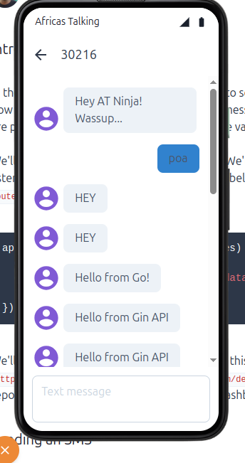

## Africastalking Golang SMS library

This is a Golang library for sending SMS messages using the Africa's Talking API. It provides a simple interface to send messages, check message status, and manage contacts.

## Installation

To install the library, use the following command:

```bash
go get github.com/Tech-Kenya/africastalking-sms-lib@latest
```

## To get started locally

1. Clone the repository:

```bash
git clone https://github.com/Tech-Kenya/africastalking-sms-lib.git
```

2. cd into the project directory

```bash
africastalking-sms-lib
```

3. Copy the `.env.example` file to `.env` and fill in your Africa's Talking credentials:

```bash
cp .env.example .env
```

`Ensure you have Golang 1,18+ installed on your machine and you have an API key from Africa's Talking.`

- Shortcode or Sender ID: <https://account.africastalking.com/apps/sandbox/sms/shortcodes/create>

###### note that after generating a new API key, it might take upto 15 mins for it to become active

- API Key: <https://account.africastalking.com/apps/sandbox/settings/key>

4. Install the dependencies:

```bash
go mod tidy
```

5. Run the example:

```bash
go run demo/cli-sample.go
```

## Usage


see demo/api for a simple API example


POST Request


```bash
curl -X POST http://localhost:8080/send-sms \
     -H "Content-Type: application/json" \
     -d '{
           "recepient": "Your number",
           "message": "Hello from Gin API"
         }'
```

Response
```json
{"Message":"Sent to 1/1 Total Cost: KES 0.8000 Message parts: 1","Recipients":[{"number":"+254....","cost":"KES 0.8000","status":"Success","statusCode":101,"messageId":"ATXid_ad8a62b0680a41351b1ea383b9b66fd1"}]}
```

